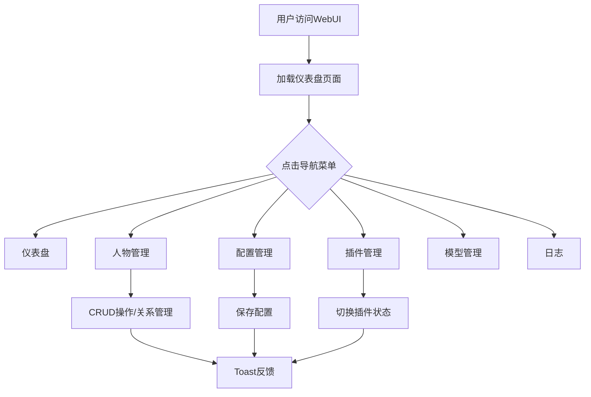

# AI仿人类程序 WebUI 产品需求文档

## 1. 产品概述

将现有的单页AI仿人类程序管理界面拆分为多个独立页面，并进行全面视觉美化。提供仪表盘、人物管理、配置管理、插件管理、模型管理和日志查看六大功能模块，采用现代极简的玻璃拟态设计风格，打造平静、精致、当代的管理后台体验。

## 2. 核心功能

### 2.1 用户角色
| 角色 | 权限 |
|------|------|
| 管理员 | 访问所有模块，执行增删改查操作 |

### 2.2 功能模块
1. **仪表盘页面**：系统状态概览、统计数据展示、人物统计图表
2. **人物管理页面**：人物列表、关系网络可视化、合并建议
3. **配置管理页面**：主配置查看与编辑、插件配置管理
4. **插件管理页面**：已安装插件列表、启用/禁用控制
5. **模型管理页面**：可用模型列表、提供商状态监控
6. **日志页面**：实时日志流查看

### 2.3 页面详情
| 页面名称 | 模块名称 | 功能描述 |
|----------|----------|----------|
| 仪表盘 | 系统状态卡片 | 展示服务状态、插件数量、活跃会话、模型状态、人物数量、关系数量 |
| 仪表盘 | 人物统计图表 | 使用Canvas绘制人物相关统计可视化 |
| 人物管理 | 人物列表 | 搜索、添加、编辑、删除人物，展示人物卡片网格 |
| 人物管理 | 关系网络 | SVG力导向图展示人物关系网络 |
| 人物管理 | 合并建议 | 智能推荐可合并的相似人物 |
| 配置管理 | 主配置 | JSON格式配置查看与编辑保存 |
| 插件管理 | 插件列表 | 展示已安装插件及启用状态 |
| 模型管理 | 模型列表 | 按提供商分组展示可用模型 |
| 日志 | 日志流 | WebSocket实时日志输出 |

## 3. 核心流程

用户打开WebUI → 左侧边栏导航选择页面 → 主内容区加载对应页面 → 各页面独立加载数据并渲染 → 模态框处理表单操作 → Toast提示操作结果

## 4. 用户界面设计

### 4.1 设计风格
- **配色方案**：
  - 背景：柔和渐变，从淡薰衣草紫(#f3e8ff)过渡到浅蜜桃色(#fef3e2)
  - 主色调：灰紫色(#8b5cf6)及其浅色变体(#a78bfa)
  - 次色调：灰粉色(#f472b6)
  - 文字：炭灰色(#374151)主文字，灰色(#6b7280)次要文字
  - 状态色：绿色(#10b981)在线，红色(#ef4444)危险/错误
- **玻璃拟态UI**：磨砂半透明卡片(rgba(255,255,255,0.85))，backdrop-filter模糊(10px)，柔和阴影
- **字体**：干净无衬线字体，紧凑字距，大量留白
- **圆角**：卡片16px，按钮12px，输入框12px，模态框24px
- **图标**：双色线描风格SVG图标
- **微交互**：温和悬停缩放(1.05)、淡入过渡、卡片上浮效果

### 4.2 布局设计
- **左侧固定深色窄边栏**：宽度72px，顶部Logo，下方垂直排列图标+标签菜单项，选中高亮指示器(左侧4px竖条)
- **移动端**：边栏折叠为汉堡菜单触发的滑出式抽屉
- **右侧主内容区**：
  - 顶部固定顶栏(64px高)：页面标题 + 系统状态指示器
  - 主体内容：响应式卡片网格，桌面端双列，移动端单列
- **阴影分隔线**：固定侧边栏与滚动内容区之间的微妙分隔

### 4.3 页面设计概览
| 页面 | 模块 | UI元素 |
|------|------|--------|
| 仪表盘 | 状态卡片 | 玻璃卡片，6宫格状态项，渐变背景数字 |
| 仪表盘 | 统计图表 | Canvas图表卡片 |
| 人物管理 | 人物卡片 | 头像(姓名首字母)+信息+操作按钮 |
| 人物管理 | 关系网络 | SVG可视化，节点可点击 |
| 配置管理 | 配置编辑器 | 等宽字体代码块样式 |
| 日志 | 日志终端 | 等宽字体，深色背景，自动滚动 |

### 4.4 响应式设计
- **桌面端**：侧边栏固定展开，双列卡片网格
- **平板端**：侧边栏固定，单列卡片
- **移动端**：侧边栏隐藏，汉堡菜单触发抽屉，单列布局，顶栏左侧预留菜单按钮空间

### 4.5 动画效果
- 页面切换：淡入+轻微上移(0.3s ease)
- 模态框：从上方滑入+缩放(0.3s ease)
- 卡片悬停：translateY(-2px) + 阴影增强
- 导航项悬停：scale(1.05) + 背景色变化
- Toast：从底部滑入(0.3s ease)
- 移动端侧边栏：translateX过渡(0.3s ease)
