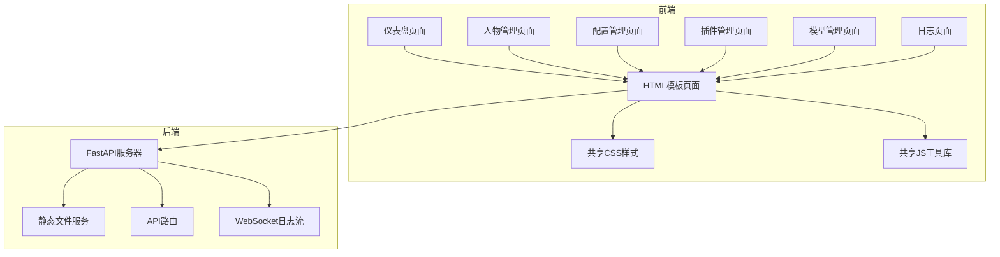

# AI仿人类程序 WebUI 技术架构文档

## 1. 架构设计



## 2. 技术描述

- **前端**：纯HTML + CSS + JavaScript，无框架依赖
- **后端**：Python FastAPI + Uvicorn
- **模板引擎**：Jinja2（FastAPI原生支持）
- **样式**：原生CSS，CSS变量定义设计令牌
- **图标**：内联SVG

## 3. 路由定义

| 路由 | 用途 |
|------|------|
| / | 仪表盘页面（默认首页） |
| /dashboard | 仪表盘页面 |
| /characters | 人物管理页面 |
| /config | 配置管理页面 |
| /plugins | 插件管理页面 |
| /models | 模型管理页面 |
| /logs | 日志页面 |
| /static/css/styles.css | 共享样式表 |
| /static/js/common.js | 共享JavaScript工具库 |
| /api/* | RESTful API接口 |
| /ws/logs | WebSocket日志流 |

## 4. 页面结构

每个页面共享以下结构：
- 基础HTML骨架（DOCTYPE、head、meta）
- 左侧边栏导航（包含Logo和菜单项）
- 移动端汉堡菜单按钮
- 顶部状态栏
- 主内容区域（各页面不同）
- 共享模态框组件（人物、关系、合并）
- Toast通知组件
- 引用共享CSS和JS文件

## 5. API定义

### 5.1 人物相关
- `GET /api/characters` - 获取所有人物列表
- `GET /api/characters/{id}` - 获取单个人物详情
- `POST /api/characters` - 创建人物
- `PUT /api/characters/{id}` - 更新人物
- `DELETE /api/characters/{id}` - 删除人物
- `POST /api/characters/merge` - 合并两个人物
- `GET /api/characters/search?q=` - 搜索人物
- `GET /api/characters/suggestions/merge` - 获取合并建议

### 5.2 关系相关
- `GET /api/relationships/network` - 获取关系网络数据
- `POST /api/relationships` - 添加关系
- `DELETE /api/relationships` - 删除关系

### 5.3 配置相关
- `GET /api/config` - 获取完整配置
- `POST /api/config` - 保存配置
- `GET /api/plugins/{name}/config` - 获取插件配置
- `POST /api/plugins/{name}/config` - 保存插件配置

### 5.4 模型相关
- `GET /api/models` - 获取模型列表

### 5.5 统计相关
- `GET /api/statistics` - 获取系统统计信息

### 5.6 日志相关
- `WebSocket /ws/logs` - 实时日志流

## 6. 文件结构

```
webui/
├── templates/
│   ├── base.html          # 基础模板（包含共享结构）
│   ├── dashboard.html     # 仪表盘页面
│   ├── characters.html    # 人物管理页面
│   ├── config.html        # 配置管理页面
│   ├── plugins.html       # 插件管理页面
│   ├── models.html        # 模型管理页面
│   └── logs.html          # 日志页面
├── static/
│   ├── css/
│   │   └── styles.css     # 共享样式表
│   └── js/
│       ├── common.js      # 共享工具函数
│       ├── dashboard.js   # 仪表盘页面逻辑
│       ├── characters.js  # 人物管理页面逻辑
│       ├── config.js      # 配置管理页面逻辑
│       ├── plugins.js     # 插件管理页面逻辑
│       ├── models.js      # 模型管理页面逻辑
│       └── logs.js        # 日志页面逻辑
└── webui_server.py        # FastAPI服务器（更新路由）
```

## 7. 共享组件说明

### 7.1 侧边栏导航
- 固定定位，宽度72px
- 包含Logo和6个菜单项
- 当前页面高亮显示
- 移动端可折叠抽屉

### 7.2 模态框系统
- 人物编辑模态框（添加/编辑共用）
- 关系添加模态框
- 合并确认模态框
- 统一的打开/关闭动画

### 7.3 Toast通知
- 固定定位右下角
- 成功/错误两种类型
- 3秒自动消失

## 8. 数据流设计

```
页面加载 → 调用对应API → 渲染数据 → 用户操作 → 调用API → 更新UI → Toast反馈
```

各页面独立管理自己的数据状态，通过共享的`common.js`中的工具函数进行API调用和UI反馈。
